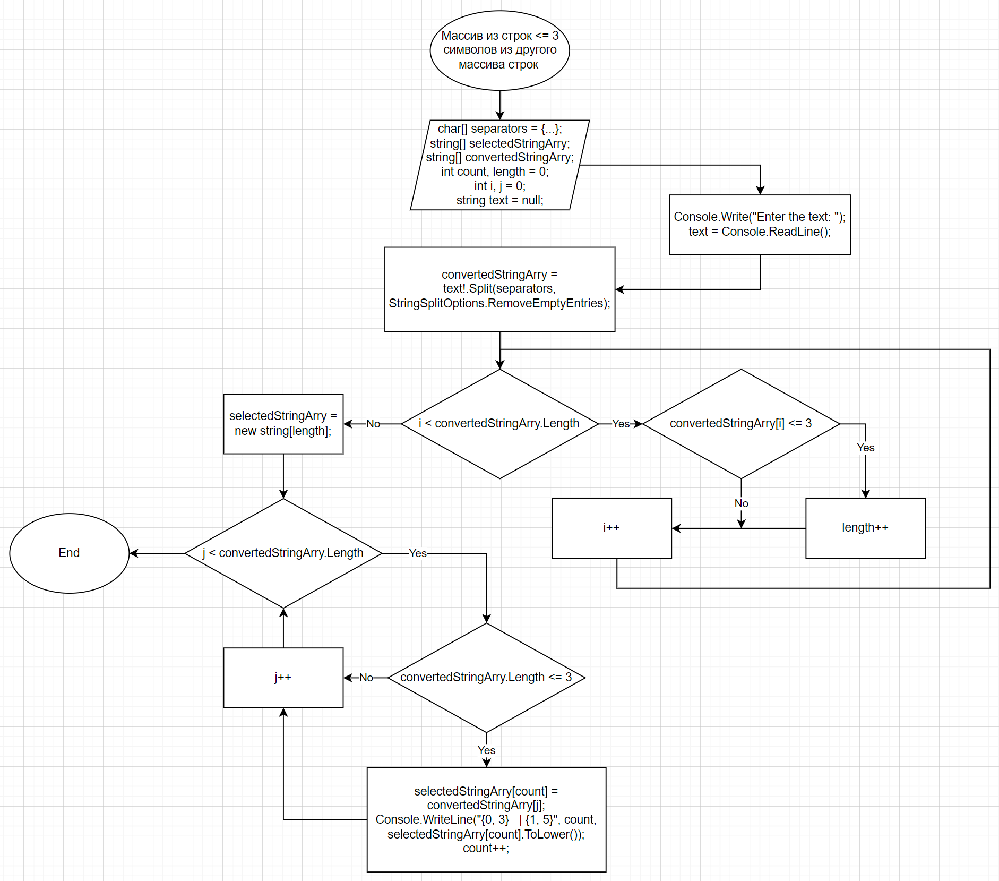

### **Task:**
*Написать программу, которая из имеющегося массива строк формирует массив из строк, длина которых меньше либо равна 3 символам. Первоначальный массив можно ввести с клавиатуры, либо задать на старте выполнения алгоритма. При решении не рекомендуется пользоваться коллекциями, лучше обойтись исключительно массивами.*

### **First solution (main branch):**
The program initializes the first array of strings. Then finds out there how many strings smaller or equal to 3 symbols. Now we have the length of the second array there we will put all strings that satisfy the condition (string length <= 3).
Then it consistently assigns strings selected by condition to the elements of second string array and prints index of the element. Next it prints second string array according to element index printed earlier.

### **Flow-chart for the fist (second_solution branch):**

### **Second solution (commit 553bdbd):**
A user enters a text without line breaks via dialog in console. The program converts the text to a string array by splitting it using separators indicated in the char array.
Next it finds out there how many strings smaller or equal to 3 symbols. Now we get the length of the second array there we will put all strings that satisfy the condition (string length <= 3). 
Then it consistently assigns strings selected by condition to the elements of second string array. Then we get completely filled second array . Next program prints index of elements and value elements of the array in lower letters. The output performs in a table format.

### **Flow-chart for the second solution (second_solution branch):**
