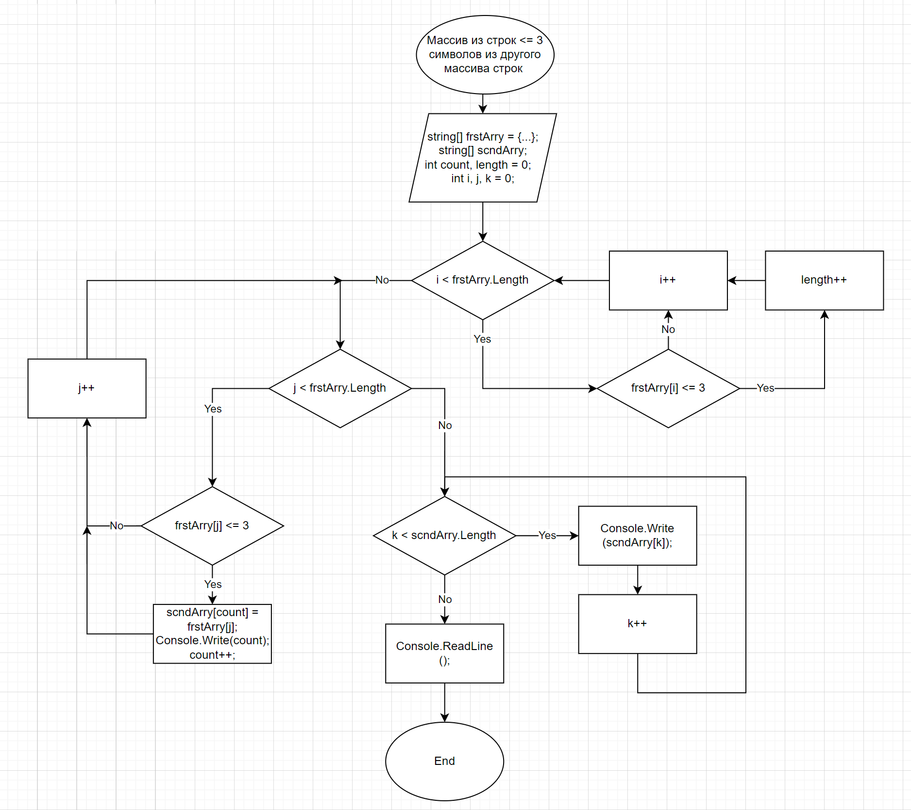

# specialization_test

### **Task:**
*Написать программу, которая из имеющегося массива строк формирует массив из строк, длина которых меньше либо равна 3 символам. Первоначальный массив можно ввести с клавиатуры, либо задать на старте выполнения алгоритма. При решении не рекомендуется пользоваться коллекциями, лучше обойтись исключительно массивами.*

### **Solution:**
Program initializes the first array of strings. Then finds out there how many strings smaller or equal to 3 symbols. Now we have the length of the second array there we will put all strings that satisfy the condition (string length <= 3).
Then its consistently assigns strings selected by condition to the elements of second string array and prints index of the element. Next it prints second string array according to element index printed earlier.

### **Flow-chart:**
